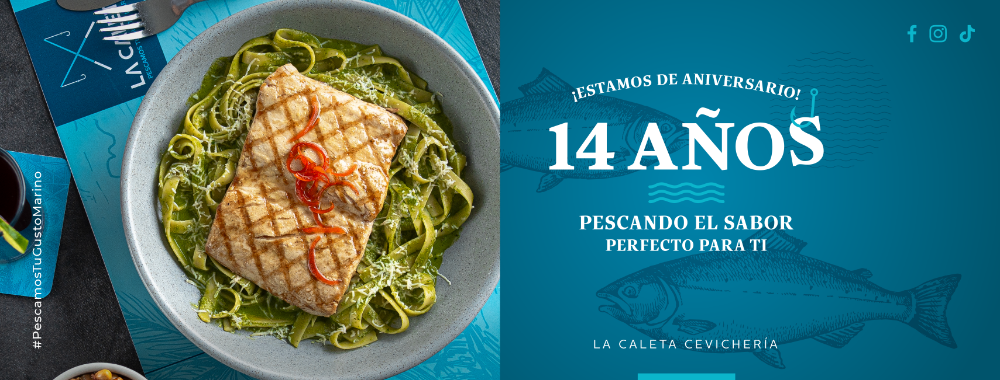
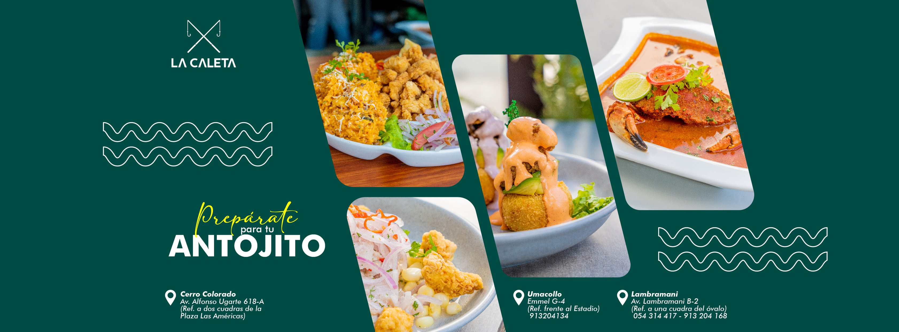

# React + TypeScript + Vite

# 🐟 La Caleta Club

**La Caleta Club** es una plataforma digital de fidelización creada para una cevichería peruana. Conecta el sabor del mar con la tecnología, permitiendo a los clientes:

- Acumular puntos por cada compra
- Canjear promociones exclusivas
- Publicar y ver recomendaciones
- Leer entradas del blog cevichero



---

## ✨ Funcionalidades principales

- ✅ Registro e inicio de sesión con validación por roles
- 🛒 Sistema de puntos y promociones personalizadas
- 🧾 Módulo de recomendaciones autenticadas
- 📰 Blog cevichero con relación a productos
- 🛠 Panel administrativo (productos, blogs, usuarios)
- 🔒 Formularios y vistas protegidas por login

---

## 🚀 Tecnologías utilizadas

| Herramienta        | Descripción                              |
|--------------------|------------------------------------------|
| **React + TS**     | Framework principal del frontend         |
| **Vite**           | Entorno de desarrollo rápido             |
| **Tailwind CSS**   | Estilos responsivos basados en utilidad |
| **Redux Toolkit**  | Manejo de estado global                  |
| **Supabase**       | Autenticación, base de datos, almacenamiento |
| **shadcn/ui**      | Componentes accesibles con Radix UI      |
| **SwiperJS**       | Carruseles para productos destacados     |

---

## 📁 Estructura del proyecto

\`\`\`
src/
├── components/         # Botones, Cards, Navbar, Footer
├── pages/              # Home, Carta, Blog, Registro, Admin
├── store/              # Redux slices (auth, carrito, etc.)
├── lib/                # Cliente de Supabase y tipos
├── routes/             # Sistema de rutas protegidas
└── App.tsx             # Estructura principal del sitio
\`\`\`

---

## 📸 Capturas del sistema

### 🐟 Portada institucional


### 🍛 Carta del día y promociones


### 🧾 Blog y recomendaciones (interno)
> Estas vistas se generan automáticamente en tiempo real desde Supabase (formulario solo visible con sesión activa)

---

## ⚙️ Instalación local

1. Clona el repositorio:
\`\`\`bash
git clone https://github.com/tuusuario/laCaleta.git
cd laCaleta
\`\`\`

2. Instala las dependencias:
\`\`\`bash
npm install
\`\`\`

3. Crea un archivo `.env` y coloca tus claves de Supabase:
\`\`\`env
VITE_SUPABASE_URL=https://xxxx.supabase.co
VITE_SUPABASE_ANON_KEY=tu_clave_anon
\`\`\`

4. Inicia el proyecto:
\`\`\`bash
npm run dev
\`\`\`

---

## 🧪 Próximas mejoras

- [ ] Dashboard con métricas de consumo
- [ ] Módulo de historial de puntos por cliente
- [ ] Notificaciones por WhatsApp o correo
- [ ] Buscador avanzado en carta y blog

---

## 👨‍🍳 Autores

Desarrollado por el equipo:

- Gustavo Fernando Gálvez Delgado  
- Luis Fernando Mansilla Musaja  
- Nicolás Pariona de la Peña  
- Alex Quispe Ccoa  

---

## 📜 Licencia

Proyecto desarrollado con fines educativos.  
Todos los derechos reservados © **La Caleta Club** – 2025.

})
```
